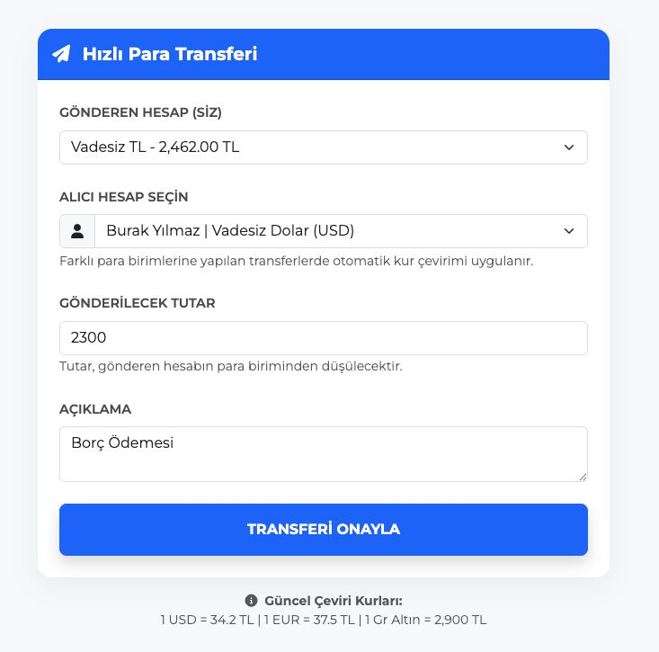
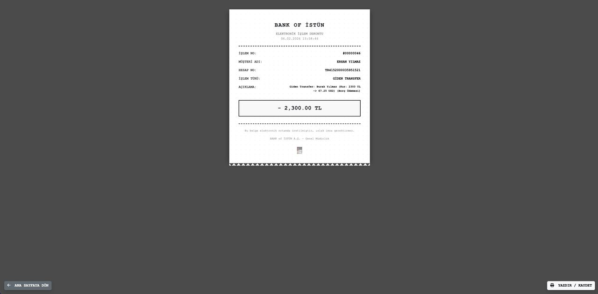
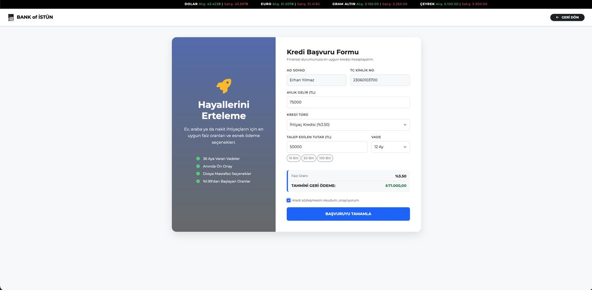
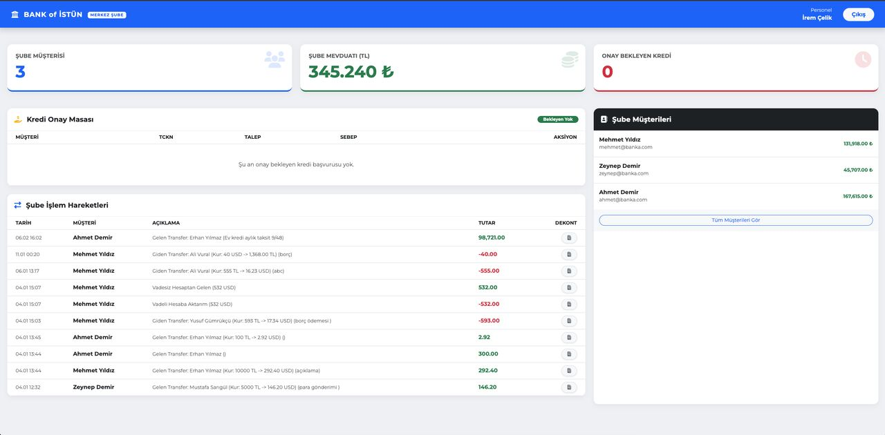
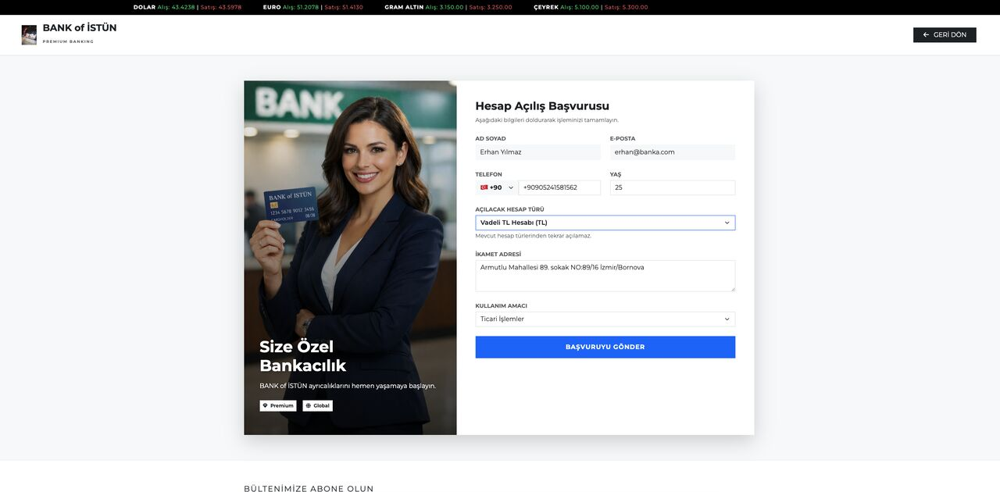

# 🏦 Bank of İstün - Advanced Banking Automation System


## 📖 Project Overview

**Bank of İstün** is a comprehensive web-based banking simulation developed as a final project for the **Database Management Systems** course at İstanbul Health and Technology University.

Unlike simple CRUD applications, this project focuses on **real-world financial data integrity**, **security**, and **complex business logic**. It simulates a full-banking environment with three distinct user roles: **Admin (Executive), Staff, and Customer.**

---

## 🚀 Key Features

### 🔒 Security & Architecture
* **ACID Compliance:** Utilizes MySQL **Transactions (Commit/Rollback)** for all fund transfers to ensure zero data loss during critical operations.
* **Secure Authentication:** Implements **PDO Prepared Statements** to prevent SQL Injection and **MD5 hashing** for password storage.
* **RBAC (Role-Based Access Control):** Strict separation of duties between Admins, Staff, and Customers using session-based authorization.

### 👤 Customer Portal
* **Dashboard:** View total assets, account details (IBAN, Balance), and recent activity.
* **Money Transfers:** Secure internal and external transfers with **automatic currency conversion** (e.g., TRY to USD) based on real-time exchange rates.
* **Loan Application:** Dynamic loan calculator and application submission module.
* **Time Deposit (Faiz):** Interactive interest yield calculator for savings accounts.
* **Digital Receipts:** Generate and view official transaction receipts (Dekont) for every operation.

### 💼 Staff Panel
* **Customer Management:** View and manage customer portfolios assigned to specific branches.
* **Loan Operations:** Review, approve, or reject pending loan applications.
* **Branch Oversight:** Monitor branch-specific liquidity and customer counts.

### 📊 Executive (Admin) Dashboard
* **Liquidity Tracking:** Real-time view of the bank's total deposits and assets across all branches.
* **System Monitoring:** Live feed of all transaction logs and user activities system-wide.
* **Performance Metrics:** Visual breakdown of active customers and staff distribution.

---

## 🛠 Tech Stack

* **Backend:** PHP 8 (Object-Oriented Programming & PDO)
* **Database:** MySQL (Relational Schema, Stored Procedures, Triggers)
* **Frontend:** HTML5, CSS3, Bootstrap 5, JavaScript (for dynamic calculations)
* **Tools:** VS Code, MAMP/XAMPP, phpMyAdmin

---

## 🗄 Database Structure

The project features a highly normalized database schema designed to minimize redundancy.

* **Tables:** `Users`, `Customers`, `Employees`, `Accounts`, `Transactions`, `Loans`, `Branches`, `AuditLogs`.
* **Logic:** Foreign keys are strictly enforced to maintain referential integrity.
* **Stored Procedures:** Used for complex login verification and transaction history retrieval.

---

## ⚙️ Installation & Setup

1.  **Clone the Repository**
    ```bash
    git clone [https://github.com/yourusername/bank-of-istun.git](https://github.com/yourusername/bank-of-istun.git)
    ```

2.  **Database Setup**
    * Open `phpMyAdmin`.
    * Create a new database named `banka_db_erhan`.
    * Import the `banka_db.sql` file located in the `sql/` folder.

3.  **Configuration**
    * Open `includes/db.php`.
    * Update the database credentials (`host`, `username`, `password`) to match your local environment.

4.  **Run the Project**
    * Move the project folder to your local server directory (`htdocs` for MAMP/XAMPP).
    * Visit `http://localhost/bank_of_istun` in your browser.

---

## 📸 Screenshots

| Executive Dashboard (Yönetici) | Money Transfer (Para Transferi) |
|:-------------------------:|:-------------------------:|
|  |  |

| Digital Receipt (Dekont) | Loan Application (Kredi Başvuru) |
|:-------------------------:|:-------------------------:|
|  |  |

| Branch Operations (Şube) | Account Opening (Hesap Açılış) |
|:-------------------------:|:-------------------------:|
|  |  |

*(Note: Screenshots are placeholders. Please update image paths.)*

---

## 👨‍💻 Author

**Erhan İMİK**
* Computer Engineering Student @ İstanbul Health and Technology University
* [LinkedIn Profile](https://www.linkedin.com/in/erhan-imik-781809229/)

---

*This project is for educational purposes.*


-----------------------------------------------------------------------------------------------------------------------------------------------------------------------

# 🏦 Bank of İstün - Gelişmiş Bankacılık Otomasyon Sistemi


## 📖 Proje Hakkında

**Bank of İstün**, İstanbul Sağlık ve Teknoloji Üniversitesi **Veritabanı Yönetim Sistemleri** dersi final projesi kapsamında geliştirilmiş, uçtan uca bir web tabanlı bankacılık simülasyonudur.

Basit veri kayıt uygulamalarının aksine, bu proje **gerçek dünya finansal veri bütünlüğü**, **güvenlik** ve **karmaşık iş mantığı** üzerine kurgulanmıştır. Sistem; **Yönetici (Admin), Personel ve Müşteri** olmak üzere üç farklı kullanıcı rolünü simüle eder.

---

## 🚀 Temel Özellikler

### 🔒 Güvenlik ve Mimari
* **ACID Uyumluluğu:** Kritik finansal işlemlerde veri kaybını önlemek için MySQL **Transaction (Commit/Rollback)** yapısı kullanılmıştır.
* **Güvenli Kimlik Doğrulama:** SQL Injection saldırılarına karşı **PDO Prepared Statements** ve şifre güvenliği için **MD5** hashing kullanılmıştır.
* **RBAC (Rol Tabanlı Yetkilendirme):** Yönetici, Personel ve Müşteri panelleri arasında oturum bazlı (session) katı erişim kontrolleri mevcuttur.

### 👤 Müşteri Paneli
* **Hesap Özeti:** Toplam varlıklar, hesap detayları (IBAN, Bakiye) ve son hareketlerin takibi.
* **Para Transferleri:** Gerçek zamanlı döviz kurları üzerinden **otomatik kur çevirimi** (Örn: TL -> USD) ile güvenli iç ve dış transferler.
* **Kredi İşlemleri:** Dinamik geri ödeme planı hesaplayan kredi başvuru modülü.
* **Vadeli Mevduat:** Anlık faiz getirisi hesaplama motoru.
* **Dijital Dekont:** Yapılan her işlem için sistem tarafından otomatik üretilen resmi işlem dekontu.

### 💼 Personel Paneli
* **Müşteri Yönetimi:** Şube bazlı müşteri portföyünü görüntüleme ve yönetme.
* **Kredi Operasyonları:** Bekleyen kredi başvurularını inceleme, onaylama veya reddetme.
* **Şube Denetimi:** Şube bazlı likidite ve müşteri sayılarını anlık izleme.

### 📊 Yönetici (Admin) Paneli
* **Likidite Takibi:** Bankanın tüm şubelerdeki toplam mevduat ve varlık durumunun anlık raporlanması.
* **Sistem İzleme:** Tüm sistemdeki işlem loglarının (Audit Logs) ve kullanıcı hareketlerinin canlı akışı.
* **Performans Metrikleri:** Aktif müşteri ve personel dağılımının görsel analizi.

---

## 🛠 Kullanılan Teknolojiler

* **Backend:** PHP 8 (Nesne Yönelimli Programlama & PDO)
* **Veritabanı:** MySQL (İlişkisel Şema, Stored Procedures, Triggerlar)
* **Frontend:** HTML5, CSS3, Bootstrap 5, JavaScript (Dinamik hesaplamalar için)
* **Araçlar:** VS Code, MAMP/XAMPP, phpMyAdmin

---

## 🗄 Veritabanı Yapısı

Proje, veri tekrarını en aza indirmek için yüksek düzeyde normalize edilmiş bir veritabanı şemasına sahiptir.

* **Tablolar:** `Users`, `Customers`, `Employees`, `Accounts`, `Transactions`, `Loans`, `Branches`, `AuditLogs`.
* **Mantık:** Veri tutarlılığını sağlamak için Foreign Key (Yabancı Anahtar) kısıtlamaları katı bir şekilde uygulanmıştır.

---

## ⚙️ Kurulum

1.  **Projeyi Klonlayın**
    ```bash
    git clone [https://github.com/kullaniciadiniz/bank-of-istun.git](https://github.com/kullaniciadiniz/bank-of-istun.git)
    ```

2.  **Veritabanı Kurulumu**
    * `phpMyAdmin` paneline gidin.
    * `banka_db_erhan` adında yeni bir veritabanı oluşturun.
    * `sql/` klasörü içindeki `banka_db.sql` dosyasını içe aktarın (Import).

3.  **Konfigürasyon**
    * `includes/db.php` dosyasını açın.
    * Veritabanı bağlantı bilgilerinizi (`host`, `username`, `password`) kendi yerel sunucunuza göre güncelleyin.

4.  **Çalıştırma**
    * Proje klasörünü yerel sunucunuzun dizinine taşıyın (MAMP/XAMPP için `htdocs`).
    * Tarayıcınızda `http://localhost/bank_of_istun` adresine gidin.

---

## 👨‍💻 Geliştirici

**Erhan İMİK**
* Bilgisayar Mühendisliği Öğrencisi İstanbul Sağlık ve Teknoloji Üniversitesi Üniversitesi
* [LinkedIn Profilim](https://www.linkedin.com/in/erhan-imik-781809229/)

**Teşekkür:**
Proje geliştirme sürecindeki değerli katkıları ve yardımları için **Oğuz CANPOLAT**'a teşekkür ederim.

---
*Bu proje eğitim amaçlı geliştirilmiştir.*
